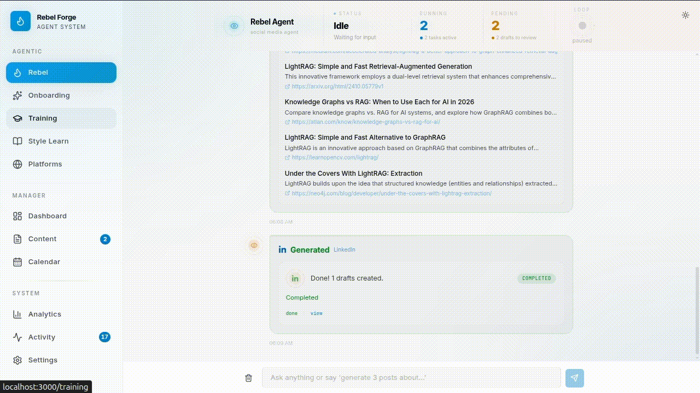

<h1 align="center">Rebel Forge</h1>

<p align="center">
  <strong>The AI agent that runs your social media. Not a dashboard. An autonomous system.</strong>
</p>

<p align="center">
  
  
  
  
  
</p>

<p align="center">
  
  
  
  
  
  
</p>

<p align="center">
  <em>Built in 2 weeks by one engineer with Claude Code + Codex CLI.<br/>For the production version, <a href="https://linkedin.com/in/hec-ovi">contact me</a>.</em>
</p>

<p align="center">
  <a href="https://www.youtube.com/watch?v=AVQRFr58sTI">
    
  </a>
</p>

---

## One Prompt. Multiple Platforms. The Agent Handles Everything.

Say _"search for AI trends, then make a post for X, LinkedIn, and Threads"_ and the agent:

1. **Searches the web** for current trends
2. **Recalls your X training** (style guide + corrections + writing patterns)
3. **Generates an X draft**
4. **Recalls your LinkedIn training**
5. **Generates a LinkedIn draft**
6. **Generates a Threads draft**
7. **Responds** (with a summary, if applies)

**One message. Six tool calls. Three platform-specific drafts. All in your trained voice.**

<p align="center">
  
</p>

---

## Why This Exists

Social media tools charge $48-399/mo for calendars and stateless GPT wrappers. They forget everything between sessions.

| Tool | Monthly Cost | Memory? | Self-Hosted? | Autonomous? |
|------|-------------|---------|-------------|-------------|
| Hootsuite | $199-399/user | No | No | No |
| Sprout Social | $199-399/seat | No | No | No |
| Later | $18-82 | No | No | No |
| Rella | $24-48 | Basic | No | No |
| **Rebel Forge** | **$0** | **Per-platform voice memory** | **Yes** | **Yes** |

---

## Agentic Tool Loop

The agent chains tools autonomously. Up to 8 steps per turn. It decides what to call, in what order, and when to stop.

| Tool | Purpose |
|------|---------|
| `recall_training` | Load platform-specific voice, corrections, and style before generating |
| `generate_drafts` | Create drafts with auto-approve and auto-publish flags |
| `web_search` | Search the web for trends, news, context |
| `generate_image` | Generate images via fal.ai or ComfyUI |
| `publish_draft` | Publish to any platform (platform-matched draft selection) |
| `approve_draft` | Approve content for publishing |
| `run_heartbeat` | Trigger full Scout > Analyst > Creator cycle |
| `update_brand` | Update voice, audience, goals |
| `setup_platform` | Generate bio, handle, starter posts |
| `query_drafts` | Query your drafts database |
| `save_onboarding` | Save brand profile from onboarding |

Real chains observed in production:

```
web_search > generate_drafts                                    (2 tools)
recall_training > generate_drafts                               (2 tools)
recall_training > web_search > generate_drafts                  (3 tools)
web_search > generate_drafts > recall_training > generate_drafts (4 tools)
```

### Tools & Error Recovery

The agent is resilient to mid-chain failures. If any step fails (API timeout, provider error, rate limit), the agent re-spins the failed step and continues from where it left off. No manual intervention, no lost progress — the chain completes even when a middle step is interrupted.

<p align="center">
  
</p>

---

## Per-Platform Voice Training

The agent doesn't just remember your brand. It remembers **how you sound on each platform**.

**General Voice** sets the baseline ("No fluff. Write like a builder."). **Per-platform styles** override it ("X: max 2 sentences. LinkedIn: 5 paragraphs with a question."). The agent recalls the right combination before every generation.

| Layer | What It Does | Stored In |
|-------|-------------|-----------|
| General Voice | Base rules for all platforms | `platform_styles` (platform=general) |
| Platform Style Guide | Per-platform tone override | `platform_styles` per platform |
| User Corrections | Original vs. edited samples with ratings | `corrections` table |
| Style Learning | Patterns from your real published posts | Learned from fetched post data |

**Same prompt, different platform, different output.** The X draft is 84 characters. The LinkedIn draft is 730.

### Style Learning

Fetch your real posts from any connected platform. Sort by engagement, views, likes, or date. Hit "Learn Style" and the agent absorbs your actual writing patterns — per platform.

The agent uses this when `recall_training` fires: your corrections, your style guide, and your real writing patterns all load before content generation.

<p align="center">
  
</p>

---

## Architecture

```
┌─────────────────────────────────────────────────────┐
│                   REBEL FORGE                       │
├──────────┬──────────────┬──────────────┬────────────┤
│ Frontend │   Backend    │   Worker     │  Database  │
│ Next.js  │   FastAPI    │  Heartbeat   │ PostgreSQL │
│  :3000   │    :8080     │  + Jobs      │   :5432    │
└──────────┴──────┬───────┴─────┬────────┴────────────┘
                  │             │
         ┌────────┴────────┐    │
         │  LLM Provider   │    │
         │  (hot-swap)     │    │
         ├─────────────────┤    │
         │ vLLM (local)    │    │
         │ Codex CLI       │    │
         │ OpenRouter      │    │
         └─────────────────┘    │
                           ┌────┴─────────────┐
                           │ Image Provider   │
                           │ (auto-fallback)  │
                           ├──────────────────┤
                           │ ComfyUI (local)  │
                           │ fal.ai (cloud)   │
                           └──────────────────┘
```

LLM and image providers are **hot-swappable from settings**. ComfyUI down? fal.ai takes over automatically.

### Local Infrastructure

Both providers run on local hardware — no cloud bills, no rate limits, no data leaving your machine.

| Service | Repo | What It Does |
|---------|------|-------------|
|  | [hec-ovi/vllm-gpt](https://github.com/hec-ovi/vllm-gpt) | GPT-OSS 20B/120B on AMD Strix Halo via ROCm — OpenAI-compatible `/v1/responses` |
|  | [hec-ovi/comfyui-strix-docker](https://github.com/hec-ovi/comfyui-strix-docker) | FLUX / Stable Diffusion on AMD RDNA 3.5 — verified ROCm Docker setup |

---

## Publishing

Live, tested, working. The agent publishes from chat with one command.

| Platform | Text | Images | Auto-publish | Live |
|----------|------|--------|-------------|------|
|  | yes | -- | yes | yes |
|  | yes | -- | yes | yes |
|  | yes | -- | yes | yes |
|  | yes | yes | yes | yes |
|  | yes | -- | yes | yes |

---

## Content Management

Masonry layout. Platform icons. Status colors. Inline editing with character limits (280 for X). Approve > Publish workflow with edit-reverts-to-draft safety. Published posts show live permalinks.

<p align="center">
  
</p>

---

## Heartbeat

Three agents on an autonomous loop:

```
Scout    → web search for trends
Analyst  → reviews past performance
Creator  → drafts content in your trained voice
```

Runs on a configurable interval. You approve or let it auto-publish.

---

## API

**65+ endpoints.** Full OpenAPI docs at `localhost:8080/docs`.

```
POST /v1/chat                           — Agentic chat with 11 tools + multi-step tool loop
POST /v1/drafts/generate                — Generate platform-specific content
POST /v1/drafts/{id}/publish            — Publish (platform-matched draft selection)
POST /v1/training/feedback              — Submit voice corrections with rating
PUT  /v1/training/platform-styles/{p}   — Set general or per-platform style guides
GET  /v1/fetch-posts/{platform}         — Fetch your posts with engagement metrics
POST /v1/training/style-learn           — Learn voice patterns from real posts
GET  /v1/training/style-learn/{p}       — Get learned style data for a platform
POST /v1/heartbeat/trigger              — Trigger autonomous agent cycle
```

---

## Tech

<p align="center">
  
  
  
  
  
  
  
</p>

---

## Demo

> **This project is at ~60% toward production.** What you see here already works — agentic tool chains, per-platform voice memory, five-platform publishing, error recovery, local inference. Built in 2 weeks by one engineer.
>
> Looking for someone who builds complex agentic systems, autonomous tooling, and production AI pipelines? That's what I do.
>
> **[hec-ovi.dev](https://hec-ovi.dev)** | **[linkedin.com/in/hec-ovi](https://linkedin.com/in/hec-ovi)**

---

<p align="center">
  <strong>Built by <a href="https://linkedin.com/in/hec-ovi">Hector Oviedo</a></strong><br/>
  <em>Engineered with AI.</em>
</p>
