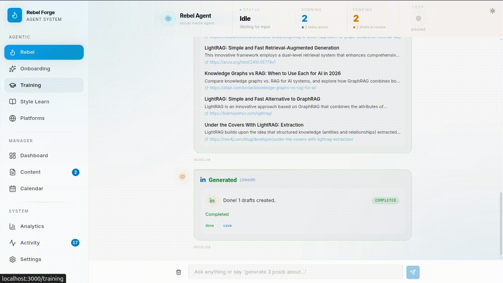

# Rebel Forge

Rebel Forge is a single-workspace social content application. It combines an agent chat, LLM-backed draft generation, per-platform writing guidance, review and publishing workflows, media generation, and post-publication metrics in a Next.js frontend backed by FastAPI, PostgreSQL, and a separate worker.

> **Portfolio and demonstration software:** the source is public for review, but it is not open source. [LICENSE](LICENSE) grants no permission to use, modify, or redistribute the original code without written permission.

## Current capability

The table describes the code in this repository. "External" means the workflow is implemented but requires a service or account that is not included in the Compose stack.

| Capability | Status | Requirements and boundaries |
| --- | --- | --- |
| Owner and viewer access | Implemented | Local bearer tokens are generated on first use and stored in `backend/data/auth_tokens.json`. This is not multi-user authentication. |
| Workspace and brand profile | Implemented | One logical workspace with one brand context. |
| Agent chat and tool execution | External | Requires an OpenAI Responses-compatible LLM endpoint, or Codex CLI on the host. Conversation and tool history are stored in PostgreSQL. |
| Draft generation and review | External | Generation requires an LLM. Editing, approval, rejection, deletion, status tracking, and publication records are implemented. |
| Calendar | Limited | Displays drafts by creation date. It does not schedule or execute future publication. |
| Voice training | External | Corrections and platform style guides are persisted. LLM analysis and recommendations require a configured LLM. |
| Style import | Credential-dependent | Fetch adapters cover X, Facebook, Instagram, and Threads. Each platform requires its own API credentials and permissions. |
| Web search | Credential-dependent | Uses Firecrawl when `FIRECRAWL_API_KEY` is configured. |
| Image generation | External | Supports an OpenAI-compatible image endpoint, ComfyUI, and fal.ai. These services are not included in Compose. |
| Publishing | Credential-dependent | Text publishing is implemented for X, LinkedIn, Facebook, and Threads. Instagram requires an image at a publicly reachable URL, normally through R2 for locally generated media. |
| Engagement metrics | Limited | Metrics are requested for posts published through Rebel Forge. Live retrieval is implemented for X, Facebook, and Instagram, with the latest successful snapshot retained. LinkedIn and Threads live metrics are not implemented. |
| Heartbeat automation | External | The worker can run periodic research and draft generation. It requires an LLM and benefits from Firecrawl. Auto-approval and auto-publishing are opt-in. |
| Share approval links | Limited | Links and expiry data are held in API process memory and are lost on restart. |

## Architecture

```text
Browser
  |
  v
Next.js :3000  --->  FastAPI :8080  --->  PostgreSQL :5432
                           |                    ^
                           v                    |
                 external providers      worker process
                 LLM, media, search      jobs and heartbeat
                 social APIs, R2
```

The API is a Python modular monolith. Draft and media generation requests are persisted as jobs, and the worker claims them from PostgreSQL. Important state changes are written to the event log. Assets use local disk by default; R2 is optional for public delivery. The frontend calls the REST API directly and polls persisted state where needed.

See [docs/architecture.md](docs/architecture.md) for component boundaries, request flows, persistence, and operational constraints.

## Docker quick start

Requirements: Docker Engine with Compose, ports `3000`, `5432`, and `8080` available, and an external LLM if you want generation features.

```bash
git clone https://github.com/hec-ovi/rebel-forge
cd rebel-forge
cp backend/.env.example backend/.env
docker compose up --build -d --wait
docker compose exec api rebel-forge-tokens
```

The last command prints the local owner and viewer tokens. Open <http://localhost:3000>, use one of those tokens on the login page, and use the owner token for configuration and mutations.

| Service | URL |
| --- | --- |
| Frontend | <http://localhost:3000> |
| API | <http://localhost:8080> |
| OpenAPI UI | <http://localhost:8080/docs> |
| Health check | <http://localhost:8080/health> |

Stop the application with `docker compose down`. PostgreSQL and generated assets remain under `backend/data`.

The Compose file starts PostgreSQL, the API, the worker, and the frontend. It does not start an LLM, ComfyUI, or any social platform service. The API and worker use host networking so the default loopback provider URLs are intended for a Linux host setup.

## Local development

Requirements: Python 3.12 or later, uv, Node.js 22 with npm, and Docker with Compose.

The development script synchronizes locked dependencies, starts PostgreSQL, applies migrations, and runs the API, worker, and frontend:

```bash
cp backend/.env.example backend/.env
./dev.sh
```

In a second terminal, print or create the login tokens:

```bash
cd backend
uv run rebel-forge-tokens
```

For separate processes instead of `dev.sh`, use these terminals after creating `backend/.env`:

```bash
# Terminal 1: database, dependencies, migrations, and API
docker compose up -d --wait postgres
cd backend
uv sync --locked
uv run alembic upgrade head
uv run uvicorn rebel_forge_backend.main:app --host 0.0.0.0 --port 8080 --reload
```

```bash
# Terminal 2: worker
cd backend
uv run python -m rebel_forge_backend.worker
```

```bash
# Terminal 3: frontend
cd frontend
npm ci
npm run dev
```

## Validation

Run backend validation from a clean dependency sync:

```bash
cd backend
uv sync --locked
uv run ruff check .
uv run pytest
```

Run frontend linting, type checking, behavioral tests, and a production build:

```bash
cd frontend
npm ci
npm run check
npm run build
```

Frontend tests use Vitest, Testing Library, user-event, jsdom, and MSW. They render pages and components, exercise user interactions, and intercept HTTP at the network boundary. Coverage is available with `npm run test:coverage`.

## Configuration

Copy [backend/.env.example](backend/.env.example) before starting. Empty optional credentials disable the related feature rather than creating a mock connection.

| Variables | Purpose |
| --- | --- |
| `DATABASE_URL` | PostgreSQL connection used by the API, migrations, and worker. |
| `DATA_BASE_PATH`, `STORAGE_BASE_PATH`, `PUBLIC_ASSET_BASE_URL` | Token, runtime data, and local asset locations. Relative paths resolve from `backend/`. |
| `LLM_BASE_URL`, `LLM_MODEL`, `LLM_API_KEY` | Default OpenAI Responses-compatible LLM. The example points to a host service on port `8000`. |
| `MEDIA_BASE_URL`, `MEDIA_MODEL`, `MEDIA_API_KEY` | Default OpenAI-compatible image endpoint. |
| `COMFYUI_BASE_URL`, `FAL_KEY`, `FAL_MODEL` | Optional image providers. |
| `FIRECRAWL_API_KEY`, `FIRECRAWL_API_URL` | Optional web search. |
| `X_*`, `LINKEDIN_*`, `FACEBOOK_*`, `INSTAGRAM_*`, `THREADS_*` | Platform credentials for profile access, importing posts, publishing, inbox data, and metrics where supported. |
| `R2_*` | Optional Cloudflare R2 bucket used to make local media publicly reachable. |

Integration credentials can be entered through the owner-only Settings connection rows or edited in `backend/.env`. There is no OAuth callback flow or automatic token refresh. Updating a connection writes the mounted `.env` file and reports that an API and worker restart is required. Treat that file and `backend/data/auth_tokens.json` as secrets.

The active LLM can also be selected in Settings. That override, including any API key supplied with it, is stored in the PostgreSQL brand profile. Available adapters are vLLM, OpenAI, xAI, OpenRouter, and Codex CLI. The standard backend container does not install the `codex` binary, so Codex CLI is host-only unless you build a custom image.

## API access

Interactive OpenAPI documentation is served at <http://localhost:8080/docs>. Use the `Authorize` control with either generated bearer token. Viewer access is read-only where supported; owner access is required for configuration and state changes.

Useful entry points include:

| Method and path | Purpose |
| --- | --- |
| `POST /v1/auth/login` | Exchange a generated token entered as the login password for its role. |
| `GET /v1/readiness` | Report database, provider, platform, and feature readiness. |
| `POST /v1/chat` | Run the agent chat and tool loop. |
| `POST /v1/drafts/generate` | Queue draft generation. |
| `GET /v1/jobs/{job_id}` | Poll a persisted job. |
| `POST /v1/media/generate` | Queue media generation. |
| `POST /v1/drafts/{draft_id}/publish` | Publish an approved draft through a configured adapter. |
| `GET /v1/drafts/{draft_id}/engagement` | Fetch live or last stored metrics for a published draft. |

## Known limitations

- The product supports one logical workspace and has no user registration, teams, billing, or tenant isolation.
- Tokens are local shared secrets, not sessions backed by an identity provider.
- External credentials are entered manually and require the relevant platform permissions.
- Generative features do not work until an LLM is reachable. No LLM model is bundled.
- The Docker image does not include Codex CLI.
- The calendar is a creation-date view, not a scheduler.
- Real analytics begin only after Rebel Forge successfully publishes a post, and live retrieval is platform-specific.
- Share approval links are in-memory and disappear when the API restarts. Public share URLs should not be treated as durable access control.
- Manual heartbeat triggering currently runs in an API-local background thread. Scheduled heartbeat checks run in the worker.
- The Compose topology uses host networking for the Python services and is optimized for the repository's Linux development environment.

## Demonstrations

### Agent chat and tool execution


### Tool activity


### Voice training



### Draft management


## License

Copyright (c) 2026 Hector Oviedo. All rights reserved. See [LICENSE](LICENSE) for the portfolio-review terms and contact information.
