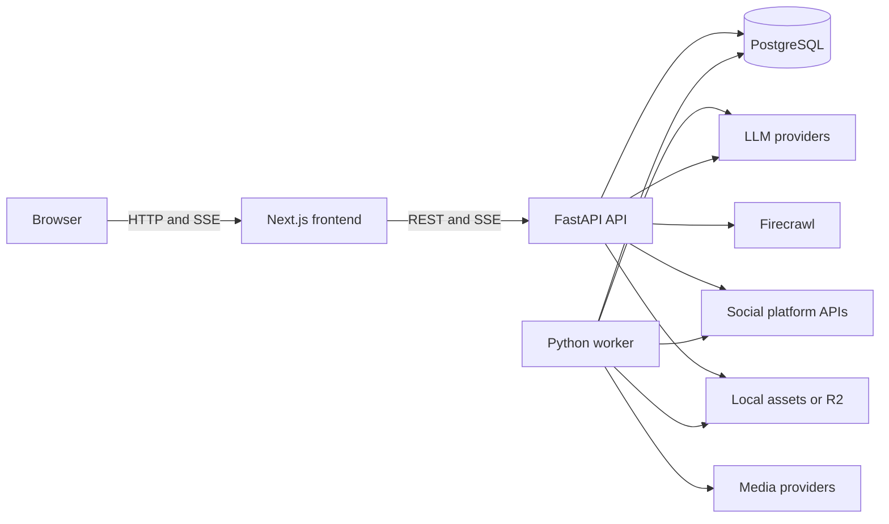
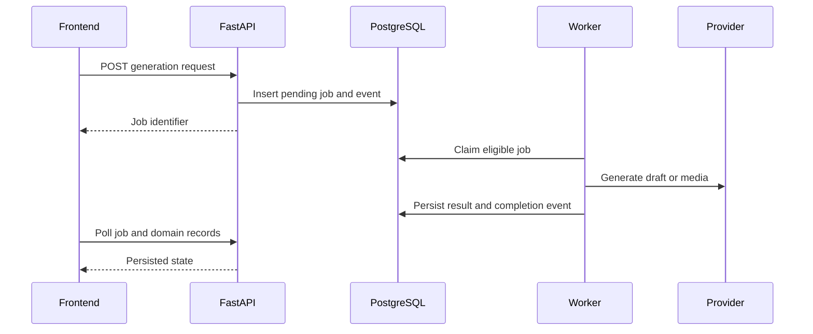

# Rebel Forge architecture

This document describes the architecture implemented in the repository. It replaces the former planning scope under `backend/instructions` and should change when the runtime changes.

## Product boundary

Rebel Forge is currently a single-workspace application for one creator or brand. It is not an agency, multi-tenant, or team product. Most durable business records carry a `workspace_id` so that a future tenancy design does not require replacing the core schema, but the current services always resolve one primary workspace.

The application uses a Python modular monolith, a Next.js frontend, and PostgreSQL. Product behavior stays in the Python backend. There is no n8n dependency, distributed agent system, or WebSocket transport.

## Runtime topology



The root Compose file starts four application services:

| Service | Responsibility |
| --- | --- |
| `postgres` | PostgreSQL 17 with the pgvector extension available to migrations. |
| `api` | FastAPI routes, authentication, chat streaming, synchronous platform calls, static local assets, and OpenAPI. |
| `worker` | Claims persisted draft and media jobs and checks the heartbeat schedule. |
| `frontend` | Next.js application served on port `3000`. |

LLM, media, search, social, and object-storage providers are external to this stack. API and worker use host networking so loopback URLs in `backend/.env` can reach services running on the Linux host.

## Component boundaries

### Frontend

`frontend/src/app` contains route-level React pages. Shared API access is centralized in `frontend/src/lib/api.ts`, which attaches the bearer token from browser storage, handles unauthorized responses, and normalizes API errors. Client-side state is kept in Zustand where shared state is needed. The browser calls FastAPI directly rather than proxying through Next.js routes.

The UI is an API client, not a second source of domain truth. Drafts, jobs, workspace data, conversations, training data, events, publication records, and metrics come from the backend. The calendar is currently a presentation of draft creation timestamps, not a scheduling engine.

### API

`backend/src/rebel_forge_backend/main.py` creates the FastAPI application, installs local-development CORS rules, mounts `/assets`, and includes the route tree from `api/router.py`.

Routes handle transport concerns and delegate to services and provider modules. The backend owns:

- prompt and context assembly;
- chat tool schemas and execution;
- workspace, draft, training, and event persistence;
- job state and validation;
- platform publishing and metric retrieval;
- authentication and authorization.

The API is REST-first. Chat responses use server-sent events. Other long-running operations return a job identifier for polling.

### Worker

`backend/src/rebel_forge_backend/worker.py` is a separate process from FastAPI. It polls PostgreSQL, claims eligible jobs with `SELECT ... FOR UPDATE SKIP LOCKED`, and processes the two implemented job types:

- `draft_generation`;
- `media_generation`.

The worker writes completion or failure state and event records. Draft-generation jobs are retried up to three attempts inside the worker; other job types receive one attempt. Pending jobs remain observable through the API.

The same worker periodically evaluates heartbeat configuration. A heartbeat performs research when Firecrawl is configured, reviews available publication history, and queues a draft-generation job. Scheduled heartbeat execution belongs to the worker. The manual trigger route is a current exception: it starts an API-local daemon thread.

### PostgreSQL

PostgreSQL is the durable memory and coordination layer. It is not delegated to an LLM response store. Alembic owns schema evolution.

The primary data groups are:

- workspaces and brand profiles;
- persisted jobs, drafts, and generated assets;
- publish accounts, publish jobs, and published posts;
- metric snapshots and audit events;
- corrections, platform styles, and conversation history added by later migrations.

Important state transitions are recorded as events. The activity UI polls those records. The worker queue and business data share the same database, avoiding a Redis requirement at the current scale.

### Provider boundaries

Provider-specific payloads stay in adapter or provider modules where practical:

| Boundary | Implementations in this repository |
| --- | --- |
| LLM | OpenAI Responses-compatible HTTP, including vLLM, OpenAI, xAI, and OpenRouter configuration; optional Codex CLI subprocess provider. |
| Media | OpenAI-compatible images, ComfyUI, and fal.ai. |
| Search | Firecrawl. |
| Publishing | X, LinkedIn, Facebook, Instagram, and Threads modules. |
| Asset delivery | Local disk storage and optional Cloudflare R2 uploads. |

The database can store an active LLM override, including its API key, with the brand profile. Platform and integration connection credentials come from `backend/.env`. The owner-only Settings connection workflow can update a writable `.env`, but processes must restart to reliably apply the new connection configuration.

## Main flows

### Authentication bootstrap

1. `rebel-forge-tokens` loads or atomically creates an owner token and a viewer token.
2. The token file is stored under `DATA_BASE_PATH` with mode `0600`.
3. The login route accepts one of those tokens as the password and returns the same bearer token plus its role.
4. FastAPI dependencies enforce viewer or owner access on protected routes.

This is local shared-secret access. It is not registration, identity federation, session rotation, or tenant isolation.

### Agent chat

1. FastAPI resolves the primary workspace and assembles brand, training, correction, product, and conversation context.
2. The active LLM comes from the database override or environment fallback.
3. An OpenAI Responses-compatible provider returns text or function calls. FastAPI executes tool calls, feeds their results into subsequent model rounds, and streams events to the browser with SSE.
4. The final conversation metadata and tool results are written to PostgreSQL.

The Codex provider follows a separate subprocess path and receives the assembled conversation in each invocation because its calls are ephemeral.

### Draft and media generation



Draft generation can enqueue media generation. Local image bytes are stored under the configured asset directory and served from `/assets`. ComfyUI results can be copied to R2 when a public URL is required. There is no automatic failover between media providers; provider selection is explicit in the request or configuration.

### Approval and publishing

Drafts move through explicit review states. Editing an approved draft returns it to draft status. Publishing calls the requested platform module synchronously. On success, the backend records a `published_posts` row, updates the draft, and appends an event.

External API credentials and platform permissions determine whether publishing succeeds. Instagram publishing additionally needs a generated image at a URL Meta can fetch. A loopback or private local asset URL is insufficient, so the current local-media path uses configured R2 storage for public delivery.

### Engagement metrics

The engagement route only operates on a recorded published post. It requests live metrics from the platform adapter and stores a `metric_snapshots` row when data is returned. If the live call fails, it returns the most recent stored snapshot. X, Facebook, and Instagram have retrieval implementations. LinkedIn and Threads do not currently return live engagement data through this route.

## Data and security considerations

- `backend/.env` contains external service secrets and is excluded from version control.
- An LLM API key entered with the active provider override is stored in the PostgreSQL brand profile.
- `backend/data/auth_tokens.json` contains owner and viewer tokens and is excluded from version control.
- The frontend stores the selected bearer token in browser local storage.
- CORS allows only the local frontend origins configured in `main.py`.
- Public share endpoints intentionally bypass bearer authentication. Their identifiers must be treated as bearer secrets.
- External prompts, media, post content, and account data leave the host when a cloud provider is configured. The project is local-first, not offline-only.
- The token model and public share links are suitable for a controlled local demo, not an internet-facing multi-user deployment.

## Current operational constraints

- One primary workspace is resolved by the service layer.
- Share records are process-local memory and are lost on API restart. They are not safe across multiple API replicas.
- Codex CLI is not installed in the standard backend image.
- The calendar does not persist publish times or dispatch scheduled posts.
- Manual heartbeat execution is not a persisted job and cannot resume after API process loss.
- Publishing calls are synchronous. The `publish_jobs` table exists, but the current publish route does not enqueue into it.
- Social credentials use manual entry. OAuth callback and refresh-token workflows are not implemented.
- Provider readiness checks establish reachability or credential presence, not end-to-end platform guarantees.
- The runtime uses polling for jobs and activity. WebSockets are not part of the current design.

## Repository map

```text
backend/
  alembic/                 Database migrations
  prompts/                 Runtime prompt templates
  src/rebel_forge_backend/
    api/                   FastAPI routing and auth dependencies
    core/                  Settings, logging, and runtime paths
    db/                    SQLAlchemy models and sessions
    providers/             LLM, media, search, and publisher integrations
    schemas/               Request and response models
    services/              Domain and orchestration services
    main.py                API entry point
    worker.py              Worker entry point
frontend/
  src/app/                 Next.js routes
  src/components/          Shared React components
  src/hooks/               API-backed React hooks
  src/lib/                 API client, store, types, and helpers
docs/
  architecture.md          This document
docker-compose.yml         Full local topology
dev.sh                     Local development process launcher
```

## Design rules

Changes should preserve these boundaries unless the architecture is deliberately revised:

1. PostgreSQL remains the source of durable business and job state.
2. Long-running draft and media generation stays outside the FastAPI request process.
3. External providers remain isolated from core domain persistence and schemas.
4. New business records should retain workspace ownership even while the product is single-workspace.
5. API and worker processes must observe the same configuration, prompts, database, and data paths.
6. Documentation should describe current behavior, including limitations, rather than planned capabilities.
